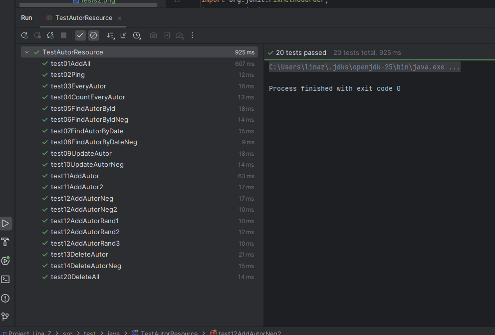

# Projeket: Project_Lina_Z - m295 Prüfung

- ### Beschreibung:
- 
- ### Datenbankdiagramm
- 
- ### Klassendiagramm Java
- 
- ### Durchgeführte Tests
  - Test für Authentication
    
  - Test für Services
    
- ### Validierungsregeln:
  - **Umsatz** @DecimalMin(value = "0.00"): Der Umsatz darf nicht kleiner als 0 sein/ negative Werte sind ungültig
  - **Gebdatum** @Past: Das Datum muss in der Vergangenheit liegen
  - **Vorname** @Size(min=1, max=25): Der Vorname darf wie in der DB nicht länger sein als 25 Zeichen
- ### Berechtigungsmatrix:
  - #### Alle haben die Rechte: @PermitAll
    - GET ping  
  - #### USER & ADMIN haben die Rechte: @RolesAllowed({"ADMIN", "USER"})
    - GET everyAutor
    - GET countEveryAutor 
    - GET findAutorById  
    - GET findAutorByDate
  - #### ADMIN hat alleiniges Recht: @RolesAllowed("ADMIN")
    - PUT updateAutor
    - POST addDB  
    - POST addAutor  
    - DELETE deleteAll  
    - DELETE deleteAutor  

- ### OpenAPI Dokumentation der Services:

- ### Autor: Lina Zweifel WUP25

- ### Zusammenfassung:
  - Ging relativ gut
  - Zeitdruck da ich nicht gut einschätzen konnte wie lange ich für die einzelnen sachen habe
  - Tests am schwierigesten da dort überprüfen der POST, PUT, Delete selvice
  - Test nicht zusammenlaufen da unterschiedlich schnell und so hardcodierte Daten nicht mehr stimmen
  - Test ablauf reihenfolge festgelegt 
  - Test PUT AddAutor wurde in DB erfolgreich eingefüht gab mir aber ein 500 zurück-> Mein Fehler bei Rückgabe Text-Plain und nicht JSON
 