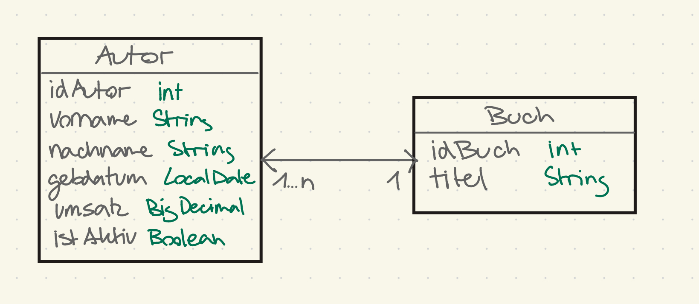
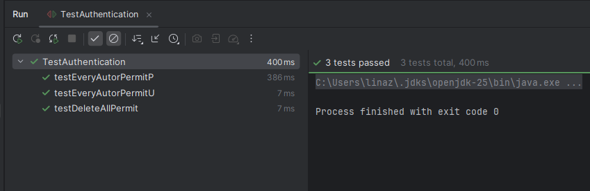
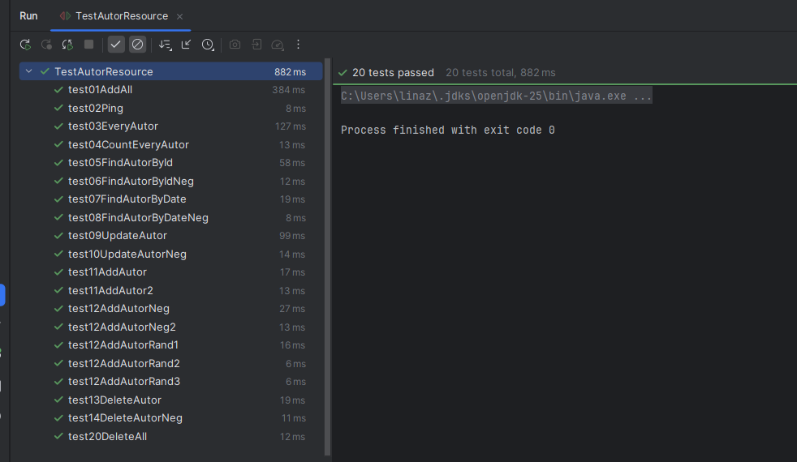

# Projeket: Project_Lina_Z - m295 Prüfung

- ### Beschreibung:
  - Diesem Projekt implemetiert eine REST-API zur Verwaltung einer Literatur-Datenbank. 
  Die Java-Klassen und die Datenbanktabellen basieren auf den Entitäten "Autor" und "Buch". 
  Dabei deckt die API alle basis CRUD-Operationen ab, also GET, PUT, POST und DELETE. 
    Zusätzlich verfügt die API über eine AUthentifizierung, um den Zugriff abzusichern. 

- ### SQL-Code:
````SQL
SET @OLD_UNIQUE_CHECKS=@@UNIQUE_CHECKS, UNIQUE_CHECKS=0;
SET @OLD_FOREIGN_KEY_CHECKS=@@FOREIGN_KEY_CHECKS, FOREIGN_KEY_CHECKS=0;
SET @OLD_SQL_MODE=@@SQL_MODE, SQL_MODE='ONLY_FULL_GROUP_BY,STRICT_TRANS_TABLES,NO_ZERO_IN_DATE,NO_ZERO_DATE,ERROR_FOR_DIVISION_BY_ZERO,NO_ENGINE_SUBSTITUTION';

CREATE SCHEMA IF NOT EXISTS literatur DEFAULT CHARACTER SET utf8 ;
USE literatur ;

    
CREATE TABLE IF NOT EXISTS literatur.buch (
  idBuch INT NOT NULL,
  titel VARCHAR(45) NULL,
  PRIMARY KEY (idBuch))
ENGINE = InnoDB;


CREATE TABLE IF NOT EXISTS literatur.autor (
  idAutor INT NOT NULL,
  vorname VARCHAR(25) NULL,
  nachname VARCHAR(25) NULL,
  gebdatum DATE NULL,
  umsatz DECIMAL(10,2) NULL,
  istAktiv TINYINT NULL,
  idBuch INT NOT NULL,
  PRIMARY KEY (idAutor),
  INDEX REL_Autor_Buch_idx (idBuch ASC) VISIBLE,
  CONSTRAINT REL_Autor_Buch
    FOREIGN KEY (idBuch)
    REFERENCES literatur.buch (idBuch)
    ON DELETE RESTRICT
    ON UPDATE RESTRICT)
ENGINE = InnoDB;


SET SQL_MODE=@OLD_SQL_MODE;
SET FOREIGN_KEY_CHECKS=@OLD_FOREIGN_KEY_CHECKS;
SET UNIQUE_CHECKS=@OLD_UNIQUE_CHECKS;
````
- ### Datenbankdiagramm
    
- ### Klassendiagramm Java
    
- ### Durchgeführte Tests
  - Test für Authentication

    

  - Test für Services

    

- ### Validierungsregeln:
  - **Umsatz** @DecimalMin(value = "0.00"): Der Umsatz darf nicht kleiner als 0 sein/ negative Werte sind ungültig
  - **Gebdatum** @Past: Das Datum muss in der Vergangenheit liegen
  - **Vorname** @Size(min=1, max=25): Der Vorname darf wie in der DB nicht länger sein als 25 Zeichen

- ### Berechtigungsmatrix:
  - #### Alle haben die Rechte: @PermitAll
    - GET ping 
    - POST addDB  
  - #### USER & ADMIN haben die Rechte: @RolesAllowed({"ADMIN", "USER"})
    - GET everyAuthor
    - GET countEveryAuthor 
    - GET findAuthorById  
    - GET findAuthorByDate
  - #### ADMIN hat alleiniges Recht: @RolesAllowed("ADMIN")
    - PUT updateAuthor
    - POST addAuthor  
    - DELETE deleteAll  
    - DELETE deleteAuthor  

- ### OpenAPI Dokumentation der Services:
    [JSON-ServiceDokumentation ansehen](src/main/resources/ServiceDokumentation.json)

- ### Autor: Lina Zweifel WUP25

- ### Zusammenfassung/Fazit:
  - Insgesamt ist das Projekt gut verlaufen, da wir alle wichtigen Prinzipien im Kurs behandelt haben. 
    Der Zeitdruck hat mir anfangs die meisten Sorgen bereitet, da ich nicht gut einschätzen konnte, wie lange ich für einzelne Aufgaben benötigen würde. 
    Vor allem, wenn Fehler auftreten, kann sich die Arbeit erheblich verzögern, wenn ich den Fehler nicht sofort finde.
  - Jetzt am Ende kann ich aber sagen, dass die zur Verfügung gestellte Zeit für mich eigentlich ausgereicht hat.
    Ich hatte noch genug Zeit, um den Code ein- oder zweimal durchzugehen. Mir ist natürlich bewusst, dass mein Code sicher nicht perfekt ist, aber ich bin letztendlich doch zufrieden mit meinem Projekt.
  - Am schwierigsten fand ich die Tests, da hier die einzelnen Services überprüft wurden und ich meist erst hier gemerkt habe, wenn ein Service nicht so funktioniert hat, wie er sollte. 
  Zusätzlich hatte ich noch Probleme damit, da die Tests unterschiedlich schnell ausgeführt wurden und meine fest codierten Testdaten dadurch nicht mehr passten, da sie sich in den einzelnen Tests verändert hatten. 
  Ein hilfreicher Tipp von Andi war, mit @Order eine feste Reihenfolge für die Testausführung festzulegen.
  - Insgesamt finde ich dieses Projekt sehr passend für den Kurs. 
  Ich konnte mich in diesen zwei Tagen auf das Projekt konzentrieren und alles Gelernte anwenden, was mir viel Spass gemacht hat. 
  Diese Anwendung hat das Modul noch einmal schön abgerundet, da das Projekt eine Art Repetition dessen war, was wir schon gelernt haben. 